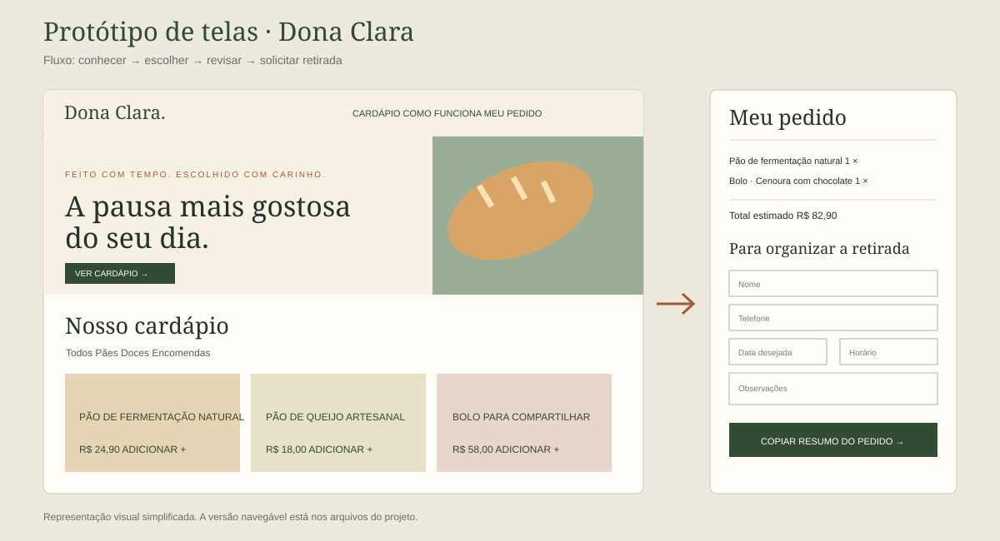

# Dona Clara — Panificadora & Empório

Desenvolvi este projeto individual para a disciplina **Design Profissional — Produção de Portfólio & Desenvolvimento Empresarial**, da Universidade Positivo, com o professor **Sedenilso Antonio Machado**.

**Lucas Marcondes Delfino** · Entrega: **05/10/2026**

## Minha proposta

Escolhi criar um **web app de pré-encomendas com uma área de gestão para a panificadora**. No estudo de caso, Clara e Roberto recebem pedidos no balcão e usam anotações manuais. Os clientes querem encomendar sem fila, enquanto a cozinha precisa evitar atrasos, trocas de sabores e pedidos perdidos.

Concentrei a solução nesse caminho: o cliente escolhe produtos e sabores, informa quando pretende retirar e envia a solicitação. A equipe recebe os detalhes na gestão, confirma a encomenda e acompanha o preparo até a retirada. Reservei a quantidade disponível no envio e devolvo essa quantidade se a equipe cancelar o pedido.

Optei por um site porque consigo atender celular e computador pelo mesmo link, sem exigir instalação. Acrescentei a gestão interna porque um catálogo sozinho não resolveria a organização da cozinha. Mantive o pagamento na retirada para não ampliar o trabalho com uma integração financeira que o enunciado não exige.

## Funcionalidades que implementei

- Cardápio com filtros, preços, descrição, sabores e disponibilidade.
- Carrinho com quantidades, variações e cálculo do total.
- Solicitação com nome, contato, data, horário e observações.
- Validação de antecedência, horário de funcionamento e quantidade mínima.
- Reserva de unidades e bloqueio de pedidos acima do saldo disponível.
- Número de pedido e acompanhamento do status pelo cliente.
- Área da equipe com busca por cliente ou pedido, filtro por data e status.
- Etapas: **Recebido → Confirmado → Em preparo → Pronto → Retirado**.
- Cancelamento com reposição das unidades reservadas.
- Atualização de disponibilidade pela equipe.
- Persistência dos pedidos e autenticação da equipe na versão com servidor.

## Protótipo e telas

Desenhei o [wireframe](docs/wireframe.svg) e detalhei minhas decisões no [documento do protótipo](docs/prototipo.md). Implementei as telas em HTML, CSS e JavaScript, permitindo percorrer o fluxo completo.

## Como executar o projeto completo

Usei **Node.js 20 ou superior**, sem pacotes externos para executar a aplicação.

1. Baixe o repositório e abra um terminal na pasta.
2. Execute `npm start`.
3. Abra `http://localhost:3000`.
4. Acesse `http://localhost:3000/admin.html` para entrar na área da equipe.
5. Use a senha temporária exibida no terminal na inicialização. Ela muda quando reinicio o servidor, caso eu não configure `ADMIN_PASSWORD` no ambiente.

Gravo os pedidos e o catálogo atualizado em `data/store.json`. Excluí essa pasta do Git e impeço seu acesso pelo servidor público. Ao reiniciar, recupero os dados do arquivo. A sessão da equipe expira em oito horas.

Posso definir `PORT`, `DATA_DIR` e `ADMIN_PASSWORD` no ambiente da hospedagem. Para produção com HTTPS, defino também `NODE_ENV=production`, que ativa o atributo Secure no cookie. Não incluí senhas nem chaves no repositório.

## Versão para GitHub Pages

Preparei também uma versão estática para apresentar o fluxo na faculdade. Para publicar, seleciono **Settings → Pages → Deploy from a branch → main → /(root) → Save**.

No Pages, salvo os pedidos no armazenamento do navegador. Consigo demonstrar pedido, estoque, gestão e acompanhamento no mesmo navegador, inclusive após atualizar a página. Os dados não são compartilhados entre dispositivos e a gestão local não usa autenticação. Para a operação centralizada com clientes em dispositivos diferentes, executo a versão com servidor descrita acima.

Como uso `fetch` para carregar o catálogo, abro o projeto por um servidor HTTP ou pelo Pages, não diretamente pelo arquivo `index.html`.

## Arquitetura que utilizei

| Arquivo | Minha implementação |
| --- | --- |
| `index.html` e `styles.css` | Organizei a vitrine, o carrinho e o acompanhamento em uma interface responsiva. |
| `script.js` | Controlei a seleção de itens, o formulário e a consulta dos pedidos. |
| `admin.html` e `admin.js` | Desenvolvi a gestão de encomendas e de disponibilidade. |
| `domain.js` | Centralizei as regras de pedido e de mudança de status. |
| `api.js` | Conectei as telas ao servidor ou ao armazenamento local do Pages. |
| `server.js` | Implementei a API, as sessões da equipe, a validação e a persistência. |
| `catalog.json` | Organizei produtos, preços, opções, saldo inicial e antecedência. |
| `tests/` | Verifiquei as regras de negócio e preparei o teste do fluxo no navegador. |

Calculo os preços no servidor a partir do catálogo, sem aceitar um total enviado pelo cliente. A gestão exige sessão autenticada na versão centralizada; a consulta individual usa um identificador privado armazenado no navegador do cliente. Protegi os campos exibidos nas telas contra inserção de HTML.

Mantive a persistência em arquivo para deixar a execução simples. Para escalar para múltiplas instâncias, precisaria migrar para um banco de dados e estruturar backups e recuperação de acesso do cliente. Não apresento o arquivo local como um banco distribuído.

## Regras que defini

| Regra | Minha definição |
| --- | --- |
| Funcionamento | Segunda a sábado, 7h às 19h; domingo, 7h às 13h. |
| Pães e cookies | Antecedência mínima de 1h. |
| Bolos e tábuas | Antecedência mínima de 24h. |
| Coffee break | Antecedência de 48h e mínimo de 5 pessoas por opção. |
| Pagamento | Na retirada. |
| Disponibilidade | Saldo livre para novas reservas; reposto pela equipe. |
| Confirmação | Feita pela equipe antes do preparo. |

Usei os fatos das seções 1 a 3 do estudo de caso para a história e as dores do negócio. Como o enunciado não informa preços, cardápio detalhado, horários e regras de antecedência, defini esses itens como premissas do projeto. Não acrescentei endereço ou telefone de outra empresa.

## Relação com os critérios da atividade

| Critério do enunciado | Como atendi |
| --- | --- |
| Resolução da dor, decisão de design e protótipo — 1,0 ponto | Justifiquei o web app, desenhei o wireframe e implementei solicitação, disponibilidade e gestão de pedidos. |
| Estrutura profissional do GitHub — 1,0 ponto | Incluí `.gitignore`, licença MIT, briefing, justificativa, protótipo, arquitetura e instruções de execução. Mantive credenciais e dados de pedidos fora do versionamento. |

Baseei essa correspondência nas seções **4 e 5** do documento *Estudo de Caso 1: Panificadora & Empório Dona Clara*. Atribuir a nota final cabe ao professor.

## Verificação

Execute `npm test` para conferir as regras de negócio. Preparei também `.github/workflows/validar.yml` para executar os testes e verificar o fluxo de cliente, gestão e acompanhamento em um navegador, incluindo a largura no celular. As capturas ficam disponíveis como artefato do workflow quando ele conclui essa etapa.

## Licença

Disponibilizei meu código sob a licença [MIT](LICENSE).
